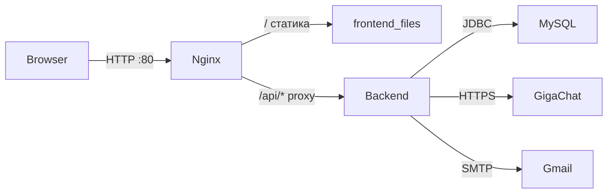

# SYSTEM / CONTEXT PROMPT: проект «Интерактивная выставка» (exhibition)

Ты работаешь с репозиторием **лабораторной/учебной веб-системы «Интерактивная выставка искусств»** (ArtGallery). Стек: **Java 21**, **Spring Boot 4.0.3**, **Spring Security + JWT**, **Spring Data JPA**, **MySQL 8**, **Flyway**, **Spring Mail (SMTP OTP)**, **GigaChat API (прокси на бэкенде)**, **springdoc-openapi 3.0.3**, фронтенд — **vanilla HTML/CSS/JS** в папке `frontend_files/`, деплой через **Docker Compose** (MySQL + Spring + **nginx**).

Базовый пакет Java: `com.bsuir.exhibition`.

---

## 1. Назначение проекта

Веб-приложение-каталог картин (≈150 записей из Met Museum) с:

- просмотром галереи, поиском и фильтрами;
- карточкой картины (модалка) + **ИИ-гид** (GigaChat через backend);
- регистрацией с **подтверждением email (6-значный OTP)**;
- входом по **JWT**;
- **избранным** (many-to-many user ↔ painting);
- **обсуждением** (комментарии к картине по `painting_id`, не по названию);
- **личным кабинетом**: вкладки «Избранное» и «Мои комментарии» (переход в обсуждение, удаление своих комментариев);
- **Swagger UI** (`/swagger-ui/index.html`, OpenAPI `/v3/api-docs`).

UI на русском, пастельная тема (CSS variables).

---

## 2. Физическая структура репозитория

```
exhibition/
├── pom.xml                          # Maven, Spring Boot 4.0.3
├── mvnw, mvnw.cmd                   # Maven Wrapper
├── Dockerfile                       # multi-stage: mvnw package → JRE + jar
├── docker-compose.yml               # database + backend + nginx
├── .dockerignore
├── nginx/
│   └── nginx.conf                   # статика + proxy /api/ → backend:8080
├── frontend_files/                  # ЕДИНСТВЕННЫЙ фронт для nginx (НЕ src/main/resources/static)
│   ├── index.html
│   ├── app.js                       # API_URL = '/api'
│   ├── style.css
│   └── favicon.ico
├── smtp.env.example                 # пример env для SMTP (опционально)
└── src/
    ├── main/
    │   ├── java/com/bsuir/exhibition/
    │   │   ├── ExhibitionApplication.java
    │   │   ├── config/              # Security, JWT filter, GigaChat RestClient, JSON
    │   │   ├── controller/          # REST API
    │   │   ├── service/             # бизнес-логика
    │   │   ├── repository/          # Spring Data JPA
    │   │   ├── entity/              # JPA сущности
    │   │   ├── dto/                 # record-DTO для API
    │   │   ├── exception/           # кастомные исключения + GlobalExceptionHandler
    │   │   └── spec/                # JPA Specification для поиска картин
    │   └── resources/
    │       ├── application.yml
    │       └── db/migration/
│           ├── V2__seed_paintings.sql
│           ├── V3__painting_comments.sql
│           └── V4__uuid_char36.sql
│       └── seed/
│           └── my_paintings_with_uuid.csv
    └── test/
        └── java/.../ExhibitionApplicationTests.java
```

**Важно:** каталог `src/main/resources/static/` **отсутствует** — фронт вынесен в `frontend_files/` для nginx.

**Flyway:** **V1** схема, **V2** сид картин из CSV, **V3** комментарии, **V4** UUID CHAR(36). Перегенерация сида: `python scripts/generate_paintings_seed.py путь/к/файлу.csv` — начальная схема/каталог могли создаваться раньше через Hibernate `ddl-auto: update` или baseline. В `application.yml`: `flyway.baseline-on-migrate: true`, `hibernate.ddl-auto: validate`.

**Docker volume `mysql_data`** — данные БД **не в архиве проекта**, только в Docker на машине.

---

## 3. Архитектура развёртывания (Docker)



| Сервис | Контейнер | Порты | Роль |
|--------|-----------|-------|------|
| `database` | art_mysql_db | 3306:3306 | MySQL 8, БД `art_db`, user `art_user` |
| `backend` | art_backend | 8080:8080 | Spring Boot JAR |
| `nginx` | art_nginx | 80:80 | `frontend_files` + reverse proxy `/api/` → `http://backend:8080/api/` |

`backend` ждёт healthy MySQL и сам проходит healthcheck (`curl` на `/api/paintings/meta/styles`). `nginx` стартует после healthy `backend`.

Локально без Docker: MySQL на `localhost`, Spring на `:8080`, фронт через nginx или с `API_URL` на `/api` при прокси.

---

## 4. Слои backend (все Java-модули/пакеты)

### 4.1. `config` — конфигурация Spring

| Класс | Назначение |
|-------|------------|
| `SecurityConfig` | CSRF off, stateless JWT, `UserDetailsService` по email, BCrypt. Публично: `/api/auth/**`, `/api/ai/**`, GET `/api/paintings/**`, swagger. Остальное технически `permitAll`, но защищённые эндпоинты требуют JWT в контроллерах/`@AuthenticationPrincipal`. |
| `JwtAuthenticationFilter` | Читает `Authorization: Bearer`, валидирует JWT, кладёт `UserDetails` в SecurityContext. Email = username в токене. |
| `GigachatProperties` | `@ConfigurationProperties` prefix `gigachat.*` |
| `GigachatRestClientConfig` | `RestClient` с опциональным insecure SSL для GigaChat |
| `JsonConfig` | Настройки Jackson (если есть кастомизация) |

### 4.2. `controller` — REST API

| Контроллер | Base path | Описание |
|------------|-----------|----------|
| `AuthController` | `/api/auth` | register, verify, login |
| `PaintingController` | `/api/paintings` | каталог, search, meta/styles, POST картины |
| `PaintingCommentController` | `/api/paintings/{paintingId}/comments` | GET список, POST комментарий (JWT) |
| `UserController` | `api/users` (без ведущего `/` в аннотации, фактически `/api/users`) | favorites toggle/get, my comments, delete comment |
| `AiController` | `/api/ai` | POST `/chat` — прокси GigaChat |

### 4.3. `service` — бизнес-логика

| Сервис | Ответственность |
|--------|-----------------|
| `AuthService` | Регистрация → `pending_registrations` + OTP email; verify → создание `User`; login → JWT |
| `JwtService` | Генерация/парсинг JWT (`application.security.jwt.*`) |
| `EmailService` | Отправка OTP через JavaMail |
| `PaintingService` | Список, поиск (Specification), стили, добавление картины |
| `FavoriteService` | Toggle/get избранного |
| `PaintingCommentService` | Комментарии к картине, «мои комментарии», удаление своего |
| `AiService` | OAuth GigaChat + chat completions, `AiProxyException` |

### 4.4. `repository` — Spring Data JPA

| Repository | Сущность |
|------------|----------|
| `UserRepository` | `User`, `findUserByEmail` |
| `PendingRegistrationRepository` | `PendingRegistration`, `findByEmail` |
| `PaintingRepository` | `Painting`, `JpaSpecificationExecutor`, `findDistinctStyles` |
| `PaintingCommentRepository` | JPQL с `JOIN FETCH` user+painting |

### 4.5. `entity` — модель БД

| Entity | Таблица | Ключевые поля / связи |
|--------|---------|------------------------|
| `User` | `users` | `id` String UUID CHAR(36), username, email, password (BCrypt), enabled, `ManyToMany` favorites → `user_favorites` |
| `Painting` | `paintings` | id String, title, author, style, description, imageUrl |
| `PaintingComment` | `painting_comments` | id, painting_id, user_id, content, created_at |
| `PendingRegistration` | `pending_registrations` | email, username, passwordHash, verificationCode (6), createdAt, expiresAt |

**UUID:** все `@Id` — тип **`String`**, колонки **`CHAR(36)`** (после миграции V3). Исторически были проблемы Hibernate `UUID` vs CHAR — решено String id.

### 4.6. `dto` — контракты API (records)

`RegisterRequest`, `VerifyRequest`, `AuthorizationRequest`, `AuthResponse`, `CreateCommentRequest`, `CommentResponse` (id UUID в JSON, paintingId String, paintingTitle, paintingAuthor, content, createdAt), `AiChatRequest`, `AiChatResponse`, `ExceptionResponse`.

### 4.7. `exception`

`InvalidCredentialsException`, `UserNotFoundException`, `AccountNotVerifiedException`, `VerificationFailedException`, `AiProxyException` + `GlobalExceptionHandler` → текстовые ответы с HTTP-кодами.

### 4.8. `spec`

`PaintingSpecifications.build(q, style, author)` — LIKE по title/author/description, фильтр style/author, сортировка в сервисе.

---

## 5. Полный список REST API

### Auth (`/api/auth`)

- `POST /register` — body: email, username, password → pending + письмо OTP; не создаёт User сразу
- `POST /verify` — email + otpCode (6 цифр) → User в `users`, удаление pending
- `POST /login` — email, password → `{ "token": "..." }`

### Paintings (`/api/paintings`) — GET публичные

- `GET /` — все картины (сортировка title ASC)
- `GET /search?q=&style=&author=&sort=` — TITLE_ASC/DESC, AUTHOR_ASC/DESC
- `GET /meta/styles` — уникальные стили
- `POST /` — добавить картину (body Painting JSON)

### Comments (`/api/paintings/{paintingId}/comments`)

- `GET /` — список `CommentResponse`
- `POST /` — JWT, body `{ "content": "..." }` → 201

### Users (`/api/users`) — JWT в заголовке

- `GET /favorites` — Set&lt;Painting&gt;
- `POST /favorites/{paintingId}` — toggle
- `GET /comments` — мои комментарии
- `DELETE /comments/{commentId}` — удалить свой → 204

### AI (`/api/ai`)

- `POST /chat` — body: message, optional context → `{ "reply": "..." }`

### Docs

- `/swagger-ui/index.html`, `/v3/api-docs` (springdoc **3.0.3** обязателен для Boot 4)

---

## 6. База данных и миграции Flyway

| Таблица | Назначение |
|---------|------------|
| `users` | аккаунты |
| `paintings` | каталог |
| `user_favorites` | PK (user_id, painting_id) |
| `pending_registrations` | до verify |
| `painting_comments` | обсуждения |

**V2** — создаёт `painting_comments` с FK CASCADE.

**V3** — конвертация UUID `binary(16)` → `CHAR(36)` для users, paintings, user_favorites, painting_comments, pending_registrations (хранимые процедуры, idempotent).

---

## 7. Конфигурация `application.yml` (ключевое)

- `spring.datasource` → MySQL (`database` в Docker, `localhost` локально)
- `spring.jpa.hibernate.ddl-auto: validate`
- `spring.flyway.enabled: true`, `baseline-on-migrate: true`
- `spring.mail.*` — Gmail SMTP для OTP
- `application.security.jwt.secret-key`, `expiration` (86400000 ms)
- `application.registration.pending-expiration-hours: 24`
- `gigachat.*` — oauth-url, chat-url, authorization-key (env `GIGACHAT_AUTH_KEY`), rq-uid, model, insecure-ssl

**Безопасность:** в yml могут быть реальные SMTP/JWT/GigaChat ключи — при переносе/публикации выносить в env.

---

## 8. Frontend (`frontend_files/`)

Один SPA без фреймворков.

### `index.html` — экраны/модалки

- Шапка: guest/user menu, кабинет, logout
- Панель поиска: q, style, author, sort, badge фильтров
- `#homeView` — masonry-галерея `#galleryGrid`
- `#profileView` — вкладки **Избранное** / **Мои комментарии**
- Модалки: `#authModal`, `#verifyModal`, `#paintingModal` (картина + ИИ-чат), `#discussionModal` (комментарии)
- Toast `#toastContainer`

### `app.js` — ключевая логика

- `API_URL = '/api'` (через nginx; не `localhost:8080`)
- JWT в `localStorage` ключ `jwt_token`
- `applyGallerySearch()` → GET `/paintings/search`
- Auth flow: register → verify modal → login
- `openPaintingModal`, `toggleFavorite`, `sendMessage` → `/api/ai/chat` с context картины
- `openDiscussionModal` / `loadComments` / `submitComment`
- `switchProfileTab`, `fetchMyComments`, `deleteMyComment`, `openDiscussionFromProfile` (флаг `discussionReturnToProfile` — закрытие ✕ возвращает в кабинет)
- Утилиты: `showToast`, `escapeHtml`, `setButtonLoading`

### `style.css`

Пастельная палитра, masonry grid, модалки, discussion, profile tabs, loaders, toasts.

Скрипт: `app.js?v=nginx-api` (cache bust).

---

## 9. Зависимости Maven (модули Spring)

- `spring-boot-starter-webmvc`
- `spring-boot-starter-data-jpa`
- `spring-boot-starter-security`
- `spring-boot-starter-mail`
- `spring-boot-starter-validation`
- `spring-boot-starter-json`
- `spring-boot-starter-flyway` + `flyway-mysql`
- `mysql-connector-j`
- `lombok`
- `springdoc-openapi-starter-webmvc-ui` **3.0.3**
- `jjwt-api`, `jjwt-impl`, `jjwt-jackson` 0.11.5
- test: `spring-boot-starter-webmvc-test`

---

## 10. Типичные потоки (для отладки)

1. **Галерея:** Browser → nginx → `GET /api/paintings/search` → `PaintingService` + `PaintingSpecifications`.
2. **Регистрация:** POST register → `pending_registrations` + email → POST verify → `users` + delete pending.
3. **Избранное:** POST favorites + JWT → `FavoriteService` меняет `user_favorites`.
4. **Комментарий:** POST comments + JWT → `PaintingComment` → FK на painting/user.
5. **ИИ:** POST `/api/ai/chat` → `AiService` → GigaChat OAuth + completions (ключи только на сервере).
6. **Ошибка «Ошибка соединения с сервером»** на фронте — `fetch` в `catch` (сеть, nginx 502, backend down, старый `app.js` с `localhost:8080`).

---

## 11. Ограничения и известные нюансы

- Каталог картин в БД не в git-миграциях V1; на чистой БД нужен seed или baseline с данными.
- ID картин после V3: часть записей могла получить id из `BIN_TO_UUID` старых binary — API и БД согласованы, но id «нестандартного» вида возможны.
- `SecurityConfig.anyRequest().permitAll()` — авторизация декларативно слабая; защита на уровне контроллеров + JWT filter.
- `UserController` mapping `api/users` без leading slash — работает, но лучше `/api/users` для единообразия.
- Перенос на Windows: Docker Desktop, порты 80/8080/3306, том `mysql_data` не в zip архива.

---

## 12. Команды разработчика

```bash
# Docker (рекомендуется)
docker compose build backend
docker compose up -d
# Сайт: http://localhost  API: http://localhost/api/...

# Локально без Docker
./mvnw spring-boot:run
# + MySQL + nginx или смена datasource url
```

---

## Инструкция для нейросети

При изменениях сохраняй разделение `frontend_files` (nginx) vs `src/` (Spring); не возвращай `API_URL` на абсолютный `localhost:8080` при Docker+nginx; для OpenAPI на Boot 4 используй springdoc ≥ 3.0.3; схему БД меняй только через Flyway при `ddl-auto: validate`; новые фичи комментариев/пользователей — через `painting_id` (String UUID), не по title.
